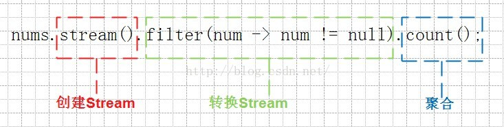
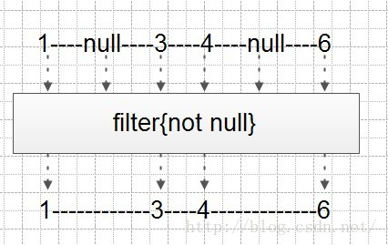

流提供了流畅的API，可以进行数据转换和对结果执行某些操作。流操作既可以是“中间的”也可以是“末端的”。
##中间的 

中间的操作保持流打开状态，并允许后续的操作。eg:filter()和map()方法就是中间的操作。

这些操作的返回数据类型是流；它们返回当前的流以便串联更多的操作。

##末端的 : 

末端的操作必须是对流的最终操作。当一个末端操作被调用，流被“消耗”并且不再可用。

_**eg:sum()方法就是一个末端的操作。**_

_**Note:中间的 操作是延迟的（lazy）。只有末端的操作会立即开始流中元素的处理。在那个时刻，不管包含了多少中间的操作，元素会在一个传递中处理（通常，但并不总是。
有状态的操作eg:sorted() 和distinct()可能需要对元素的二次传送。）**_

##处理流步骤

_**（注：这里的步骤和下面讲到的“使用Stream的基本步骤”道理是一样。只是理解方式不同）**_

从某个源头获得一个流。执行一个或更多的中间的操作。执行一个末端的操作。 
Note：可能你想在一个方法中执行所有那些步骤。那样，就需要知道源头和流的属性，
而且要可以保证它被正确的使用。你可能不想接受任意的Stream实例作为你的方法的输入，
因为它们可能具有你难以处理的特性，比如并行的或无限的。
 

#流操作的特性
1.有状态的:有状态的操作给流增加了一些新的属性，如:元素的唯一性，
或者元素的最大数量，或者保证元素以排序的方式被处理。这些典型的要比无状态的中间操作代价大。

2.短路:
短路操作潜在的允许对流的操作尽早停止，而不去检查所有的元素。
这是对无限流的一个特殊设计的属性；如果对流的操作没有短路，那么代码可能永远也不会终止。

###2.3 中间的 操作（API方法）
filter()--> 排除所有与断言不匹配的元素。  
map() -->通过Function对元素执行一对一的转换。  
flatMap()-->通过FlatMapper将每个元素转变为无或更多的元素。  
peek()-->对每个遇到的元素执行一些操作。主要对调试很有用。  
distinct() -->根据.equals行为排除所有重复的元素。这是一个有状态的操作。  
sorted()-->确保流中的元素在后续的操作中，按照比较器（Comparator）决定的顺序访问。这是一个有状态的操作。  
limit()-->保证后续的操作所能看到的最大数量的元素。这是一个有状态的短路的操作。  
substream()-->确保后续的操作只能看到一个范围的（根据index）元素。像不能用于流的String.substring一样。也有两种形式，一种有一个开始索引，一种有一个结束索引。二者都是有状态的操作，有一个结束索引的形式也是一个短路的操作。  

###2.4 末端的 操作（API方法）
forEach() -->对流中的每个元素执行一些操作。  
toArray() --> 将流中的元素倾倒入一个数组。  
reduce() --> 通过一个二进制操作将流中的元素合并到一起。  
collect() --> 将流中的元素倾倒入某些容器，eg:一个Collection或Map.  
min() --> 根据一个比较器找到流中元素的最小值。  
max() --> 根据一个比较器找到流中元素的最大值。  
count() --> 计算流中元素的数量。  
anyMatch() --> 判断流中是否至少有一个元素匹配断言。这是一个短路的操作。  
allMatch() --> 判断流中是否每一个元素都匹配断言。这是一个短路的操作。  
noneMatch()--> 判断流中是否没有一个元素匹配断言。这是一个短路的操作。  
findFirst()--> 查找流中的第一个元素。这是一个短路的操作。  
findAny() --> 查找流中的任意元素，可能对某些流要比findFirst代价低。这是一个短路的操作。  

##3. 使用Stream的基本步骤
1）创建Stream；  
2）转换Stream，每次转换原有Stream对象不改变，返回一个新的Stream对象（可以有多次转换）；  
3）对Stream进行聚合（Reduce）操作，获取想要的结果。

（注：官方文档reduce，也叫fold。“聚合”一词是我自己翻译的；也可以理解为合并。具体怎么译看每个人怎么理解。也有人译成 汇聚。）

eg：

剖析Stream通用语法

图片就是对于Stream例子的一个解析：原本一条语句被三种颜色的框分割成了三个部分。
红色框中的语句是一个Stream的生命开始的地方，负责创建一个Stream实例；
绿色框中的语句是赋予Stream灵魂的地方，把一个Stream转换成另外一个Stream，红框的语句生成的是一个包含所有nums变量的Stream，进过绿框的filter方法以后，重新生成了一个过滤掉原nums列表所有null以后的Stream；
蓝色框中的语句是丰收的地方，把Stream的里面包含的内容按照某种算法来汇聚成一个值，例子中是获取Stream中包含的元素个数。
过程解析如图：

4.创建Stream
最常用的创建Stream有两种途径：

1）通过Stream接口的静态工厂方法（Note：Java8里接口可以带静态方法）。

2）通过Collection接口的默认方法 stream()，把一个Collection对象转换成Stream。

 https://www.2cto.com/kf/201605/511947.html